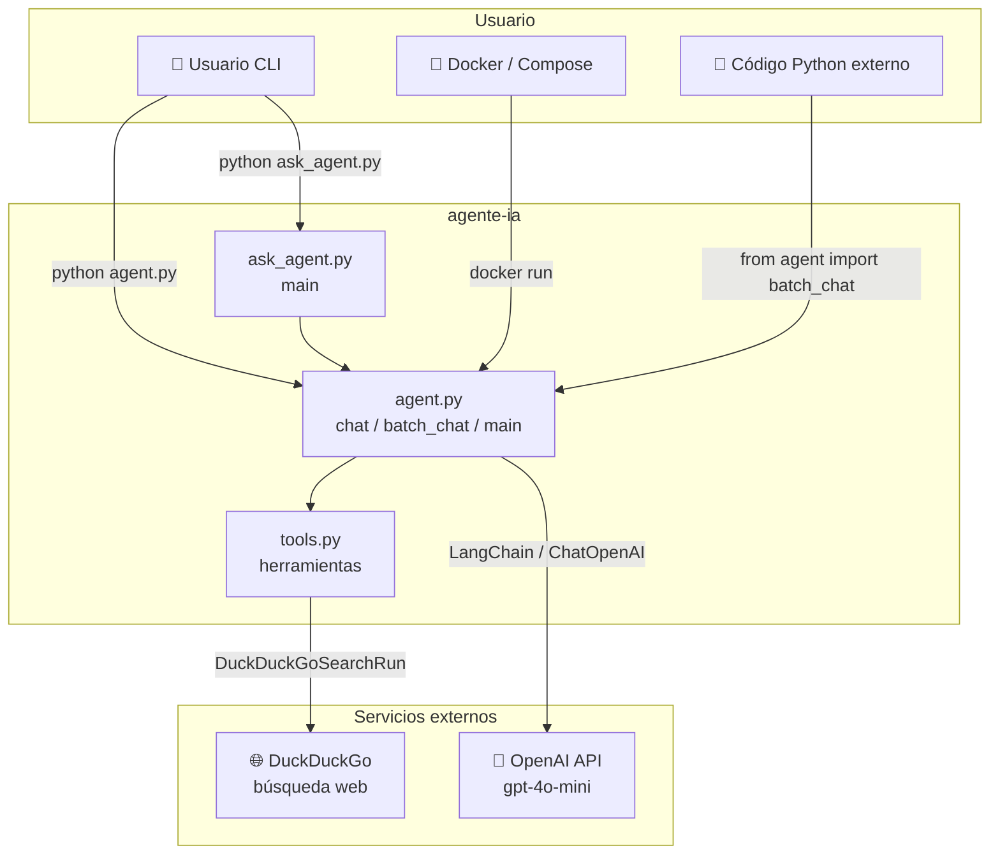
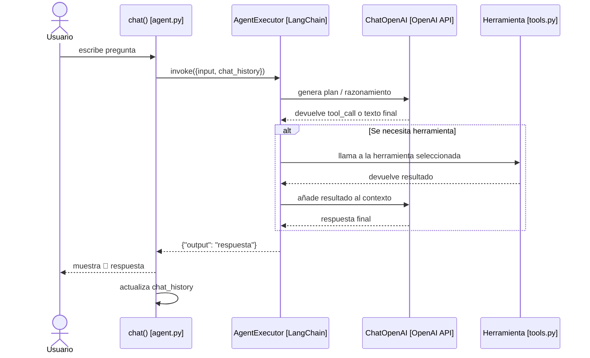

# agente-ia

Agente conversacional en Python con LangChain + OpenAI, pensado para aprender y ejecutar casos reales de forma simple.

## ¿Qué hace este proyecto?

- 🔍 Busca información en internet (`DuckDuckGo`)
- 🔢 Resuelve cálculos matemáticos
- 🐍 Ejecuta código Python limitado
- 🧠 Selecciona automáticamente la herramienta adecuada según la pregunta
- 📦 Incluye ejecución local y con Docker

## Estructura del proyecto

```text
agente-ia/
├── .env.example
├── agent.py
├── ask_agent.py
├── tools.py
├── Dockerfile
├── docker-compose.yml
├── requirements.txt
├── docs/
│   └── diagrams.md   ← diagramas del proyecto
└── tests/
```

## Diagramas

El archivo [`docs/diagrams.md`](docs/diagrams.md) contiene el análisis visual completo del proyecto (8 diagramas Mermaid).

### Visión general del sistema



### Flujo de una pregunta



## Requisitos

- Python 3.10+ (local)
- Clave de OpenAI (`OPENAI_API_KEY`)
- Docker (opcional, para ejecución containerizada)

## Configuración local (quickstart)

```bash
git clone https://github.com/juanfranciscofernandezherreros/agente-ia.git
cd agente-ia

python -m venv .venv
source .venv/bin/activate  # Linux/Mac
# .venv\Scripts\activate   # Windows

pip install -r requirements.txt
cp .env.example .env
# Edita .env y define OPENAI_API_KEY
```

## Uso

### 1) Modo interactivo

```bash
python agent.py
```

### 2) Modo batch con `agent.py`

```bash
python agent.py --questions "¿Cuánto es 2+2?" "¿Qué día es hoy?" "¿Raíz cuadrada de 144?"
```

### 3) Modo batch con `ask_agent.py`

```bash
python ask_agent.py "¿Cuánto es 2+2?" "¿Qué día es hoy?"
```

### 4) Uso programático

```python
from agent import batch_chat

resultados = batch_chat(
    [
        "¿Cuánto es 2+2?",
        "¿Qué fecha y hora es ahora?",
        "Genera los primeros 5 números de Fibonacci",
    ]
)
```

## Docker

> El contenedor lee la API key desde `.env`.

### Construir imagen

```bash
docker build -t agente-ia .
```

### Ejecutar en modo interactivo

```bash
docker run --rm -it --env-file .env agente-ia
```

### Ejecutar en modo batch

```bash
docker run --rm --env-file .env agente-ia \
  python agent.py --questions "¿Cuánto es 2+2?" "¿Qué hora es?"
```

### Con Docker Compose

```bash
docker compose run --rm agente-ia
```

## Testing

```bash
python -m pytest -q
```

## Herramientas disponibles

| Herramienta | Descripción |
|---|---|
| `search_web` | Busca información en internet usando DuckDuckGo |
| `calculator` | Calcula expresiones matemáticas (`+`, `-`, `*`, `/`, `sqrt`, etc.) |
| `run_python` | Ejecuta código Python en entorno restringido |
| `get_current_datetime` | Devuelve fecha y hora actual |

## Notas de seguridad

- `calculator` y `run_python` usan ejecución restringida, pero no sustituyen un sandbox de producción.
- Para uso productivo, se recomienda aislamiento adicional (contenedores, límites de recursos y controles de red).
