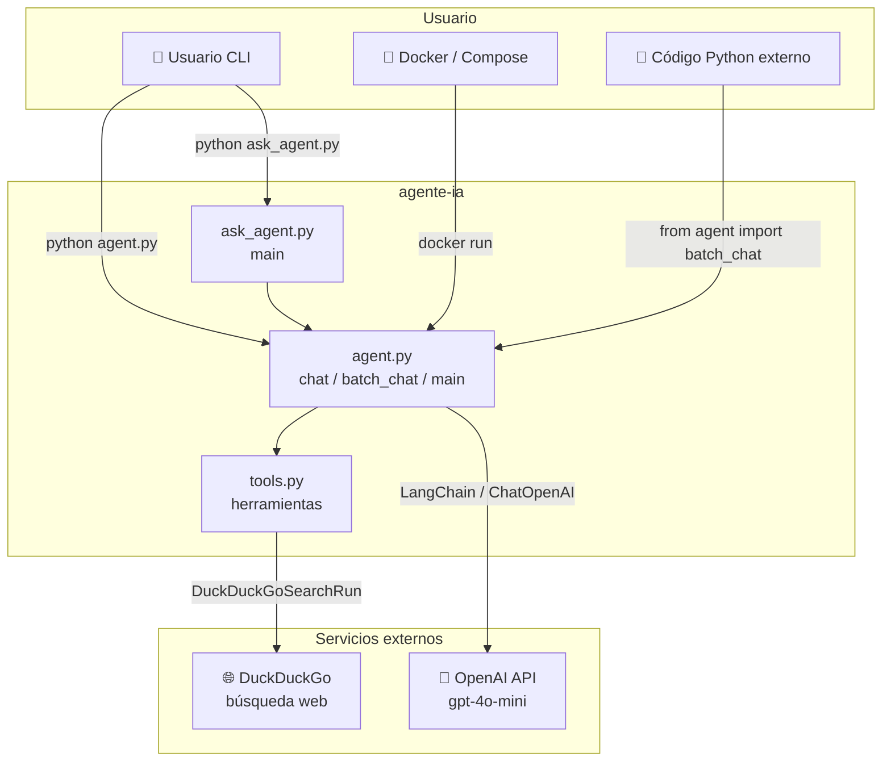
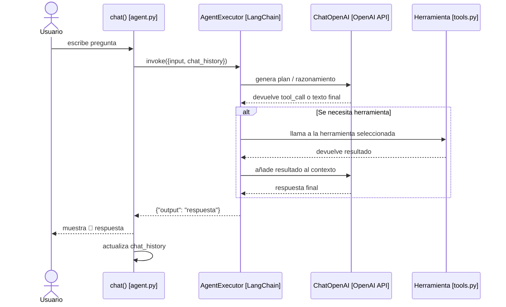
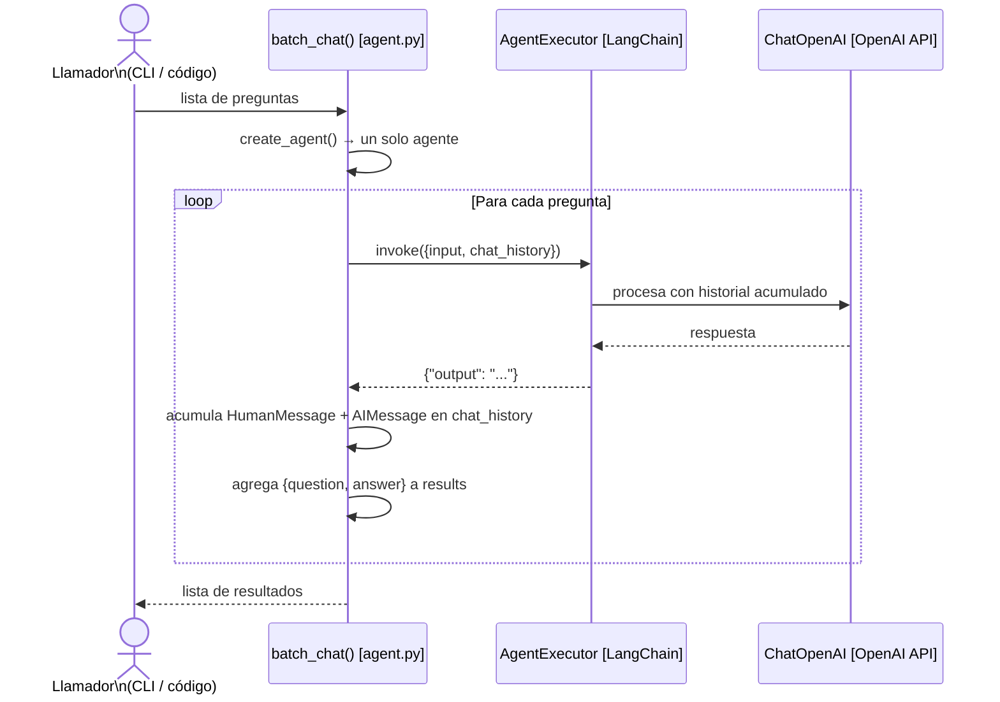
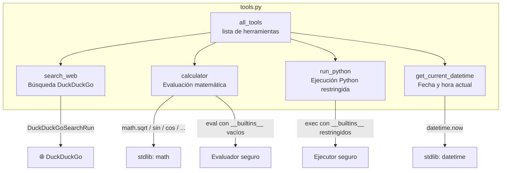
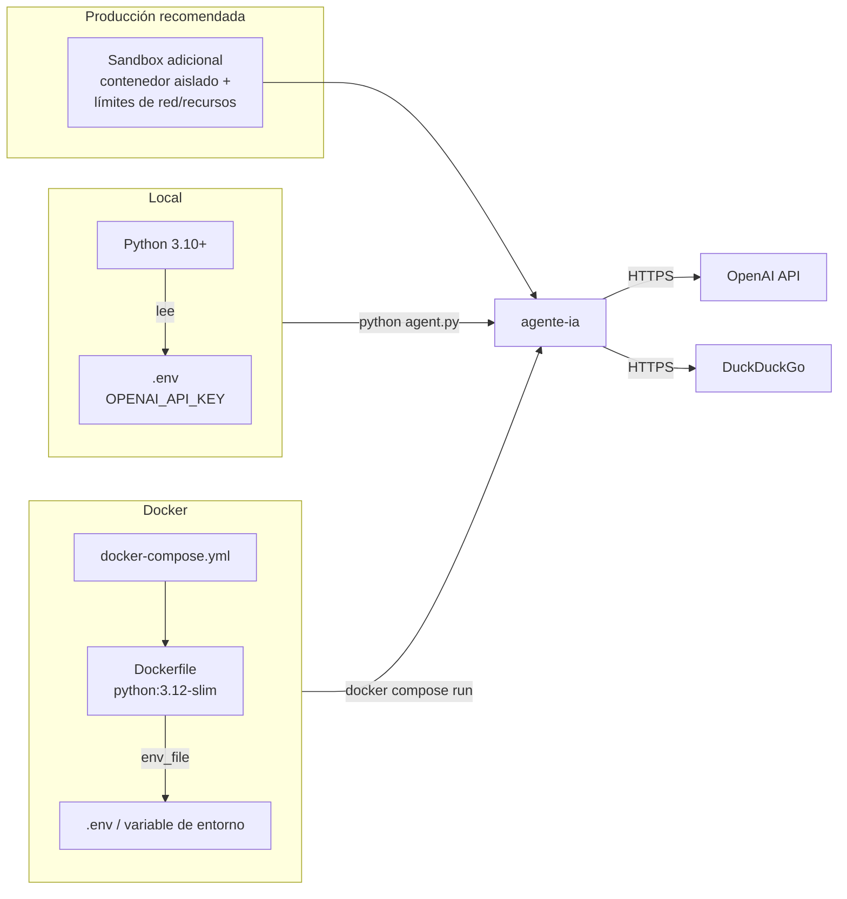
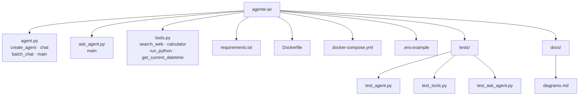

# Diagramas del Proyecto agente-ia

Diagramas de análisis generados con [Mermaid](https://mermaid.js.org/), que GitHub renderiza automáticamente.

---

## 1. Visión general del sistema

Contexto del sistema y actores que interactúan con el agente.



---

## 2. Dependencias entre módulos

Relaciones de importación entre los ficheros Python del proyecto.

```mermaid
graph LR
    subgraph Proyecto
        AG[agent.py]
        AS[ask_agent.py]
        TO[tools.py]
    end

    subgraph LangChain
        LC1[langchain_openai\nChatOpenAI]
        LC2[langchain_classic.agents\nAgentExecutor\ncreate_openai_tools_agent]
        LC3[langchain_core.prompts\nChatPromptTemplate\nMessagesPlaceholder]
        LC4[langchain_core.messages\nHumanMessage / AIMessage]
        LC5[langchain_core.tools\n@tool]
        LC6[langchain_community.tools\nDuckDuckGoSearchRun]
    end

    subgraph Stdlib
        PY1[math]
        PY2[datetime]
        PY3[argparse / os]
        PY4[python-dotenv]
        PY5[sys]
    end

    AS -->|from agent import batch_chat| AG
    AS --> PY5
    AG --> TO
    AG --> LC1
    AG --> LC2
    AG --> LC3
    AG --> LC4
    AG --> PY3
    AG --> PY4
    TO --> LC5
    TO --> LC6
    TO --> PY1
    TO --> PY2
```

---

## 3. Diagrama de secuencia — pregunta interactiva

Flujo completo desde que el usuario escribe una pregunta hasta que recibe la respuesta en modo interactivo (`python agent.py`).



---

## 4. Diagrama de secuencia — modo batch

Flujo para `batch_chat()` con múltiples preguntas (usado por `--questions` y `ask_agent.py`).



---

## 5. Diagrama de flujo — punto de entrada `main()`

Lógica de decisión al ejecutar `python agent.py`.

```mermaid
flowchart TD
    Start([Inicio: python agent.py]) --> Parse[Parsear args con argparse]
    Parse --> HasQ{"¿args.questions\nestá definido?"}

    HasQ -- Sí --> Batch[batch_chat(questions)]
    HasQ -- No --> Interactive[chat() modo interactivo]

    Batch --> Loop1[Procesa cada pregunta\ncon historial compartido]
    Loop1 --> Done1([Fin])

    Interactive --> Loop2[Espera input\ndel usuario]
    Loop2 --> EmptyQ{¿Input vacío?}
    EmptyQ -- Sí --> Loop2
    EmptyQ -- No --> Salir{"¿salir / exit / quit?"}
    Salir -- Sí --> Done2([Fin])
    Salir -- No --> Invoke[agent.invoke]
    Invoke --> Print[Muestra respuesta]
    Print --> Loop2
```

---

## 6. Componentes de las herramientas (`tools.py`)

Descripción de cada herramienta y sus dependencias.



---

## 7. Arquitectura de despliegue

Entornos de ejecución disponibles.



---

## 8. Resumen de la estructura del proyecto


